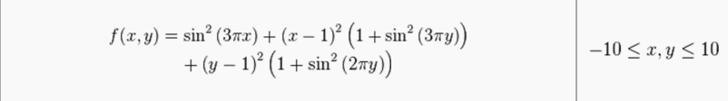
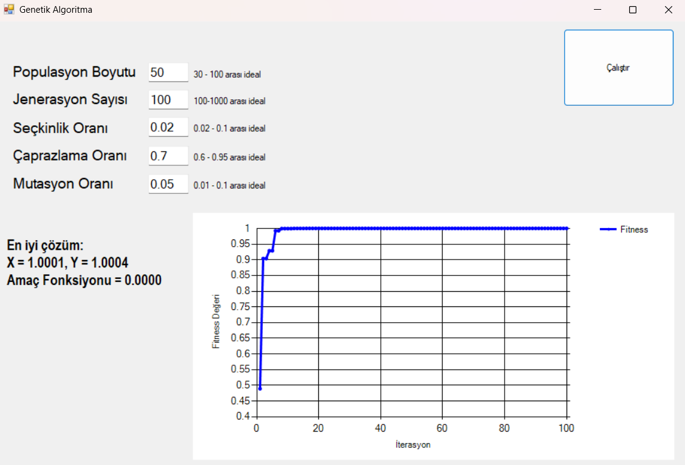

# Optimization Problem Solver

This project is developed to solve a specific **optimization problem**. The goal is to obtain the best (optimal) result based on given constraints and an objective function.

##  Problem Definition

The following image shows the graphical representation and details of the optimization problem:

This problem includes [constraints, variables, and an objective function]. It has been mathematically modeled and then solved accordingly.

##  Solution & Results

The outputs obtained through the applied algorithm/strategy are visualized below:

The graph shows the values obtained during the solution process and the final optimal result.
